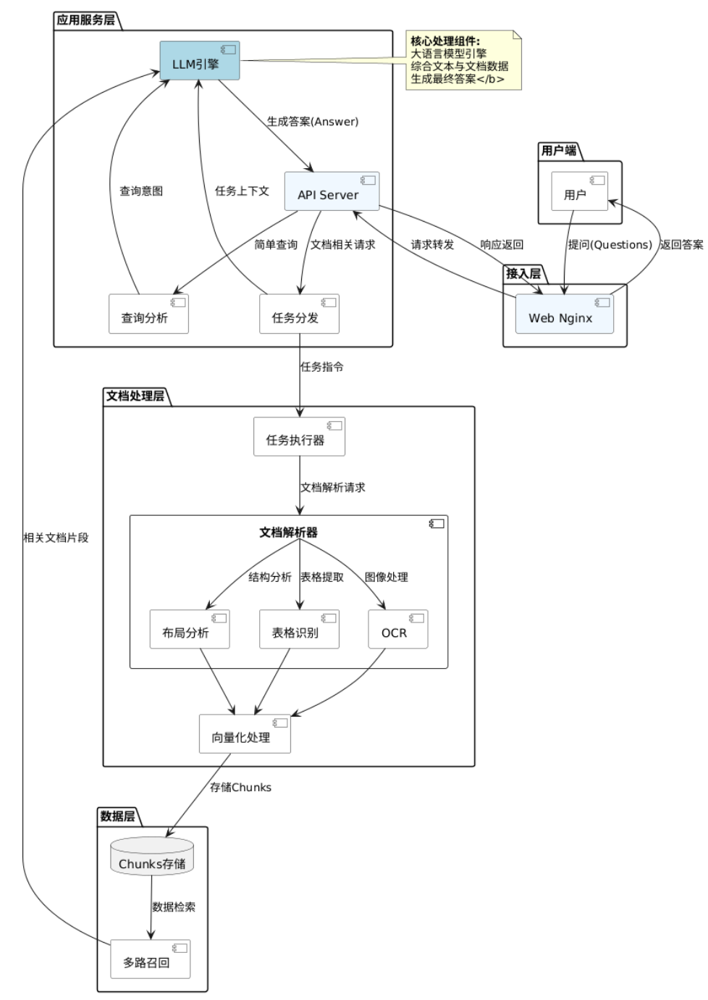

_注：更新于 2025-7-29_

[](https://skillicons.dev)

## This is @RAGF-01-backend

---




# ASF-RAG 后端服务

一个基于 FastAPI + Ollama 提供服务的 RAG (检索增强生成) 后端服务，用于处理文档解析，知识库管理，知识图谱生成，RAG 检索，向量存储，Ollama 服务管理，智能问答。

## 项目结构

```
ASF-RAG-backend/
├── ASF_SRE/
├── assets/                     # 静态资源目录
├── chat_units/                 # 聊天相关功能
│   ├── chat_documents/        # 聊天文档存储
│   └── chat_management/       # 聊天管理功能
├── document_processing/       # 文档处理模块
│   ├── doc_list.py           # 文档列表管理
│   ├── doc_manage.py         # 文档CRUD操作
│   ├── doc_upload.py         # 文件上传处理
│   └── pipeline.py          # 文档处理流水线
├── knowledge_base/           # 知识库管理
│   ├── knowledgeBASE4CURD.py # 知识库CRUD操作
│   └── knowledge_graph/      # 知识图谱相关
├── knowledge_graph/          # 知识图谱模块
├── RAG_M/                    # RAG核心模块
│   ├── src/                  # RAG核心实现
│   │   ├── api/             # API路由
│   │   ├── ingestion/       # 文档摄取
│   │   ├── models/          # 数据模型
│   │   ├── rag/             # RAG管道
│   │   ├── scripts/         # 脚本工具
│   │   └── vectorstore/     # 向量存储
│   └── RAG_app.py           # RAG应用入口
├── RAGF_User_Management/    # 用户管理模块
├── main.py                  # 主应用入口
└── requirements.txt         # 项目依赖

```

### 4.1 克隆项目

```bash
# 克隆代码仓库
git clone <repository-url>
cd ASF-RAG-backend
```

### 4.2 安装依赖

```bash
# 创建虚拟环境
python -m venv venv
# 激活虚拟环境
# Windows:
venv\Scripts\activate
# macOS/Linux:
source venv/bin/activate

# 安装依赖
pip install -r requirements.txt
```

### 4.3 启动 FastAPI 服务

```bash
python main.py --host 0.0.0.0 --port 8000 --reload
```
