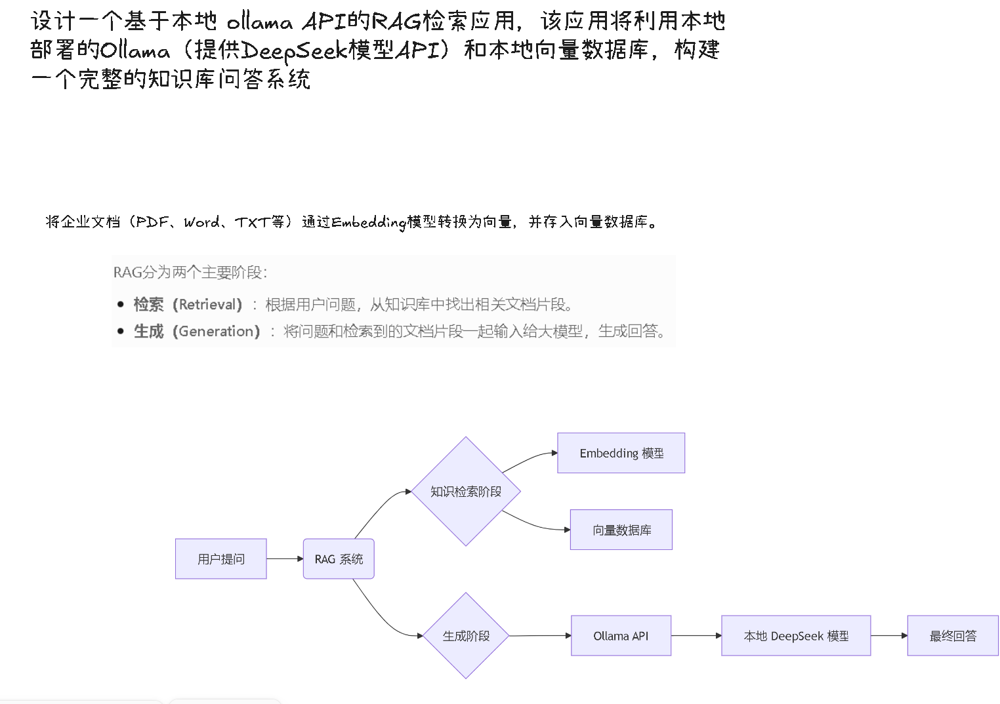
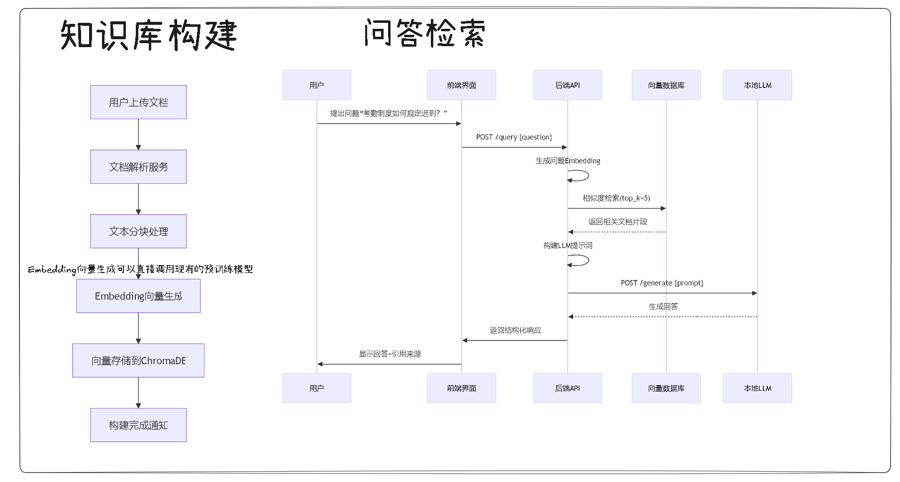

## This is @RAGF-01

---

---

### Contributors 📋

*Thanks goes to these wonderful people:*

<table border="1" cellpadding="10" cellspacing="0" width="100%" align="center">
    <tr>
        <td align="center" valign="top">
            <a href="https://github.com/Zhongye1">
                
                 
                <strong>Gotoh Hitori</strong>
                 
                <em>GitHub: <a href="https://github.com/Zhongye1">@Zhongye1</a></em>
                 
                Contributions:  代码 💻  写文档 📖
            </a>
        </td>
        <td align="center" valign="top">
            <a href="https://github.com/ourcx">
                
                 
                <strong>褚喧</strong>
                 
                <em>GitHub: <a href="https://github.com/ourcx">@ourcx</a></em>
                 
                Contributions: 正在贡献
            </a>
        </td>
        <td align="center" valign="top">
            <a href="https://github.com/haha-1205">
                
                 
                <strong>ZXT</strong>
                 
                <em>GitHub: <a href="https://github.com/haha-1205">@haha-1205</a></em>
                 
                Contributions: 贡献
            </a>
        </td>
        <td align="center" valign="top">
            <a href="https://github.com/HJX">
                
                 
                <strong>HJX</strong>
                 
                <em>GitHub: <a href="https://github.com/HJX">@HJX</a></em>
                 
                Contributions: 友情客串
            </a>
        </td>
        <td align="center" valign="top">
            <a href="https://github.com/z1pperexplorer">
                
                 
                <strong>A1r</strong>
                 
                <em>GitHub: <a href="https://github.com/z1pperexplorer">@z1pperexplorer</a></em>
                 
                Contributions: Contributing
            </a>
        </td>
    </tr>
</table>

## # 后续开发

1. ~~实现用户认证和权限管理~~
2. ~~添加模型支持和参数配置~~
3. ~~实现文件处理能力，支持更多格式~~
4. ~~知识库管理：完整的知识库 CRUD 操作，支持文件上传、管理和检索测试。~~
5. ~~搜索功能：支持多语言环境下的文档检索，包括自动语言检测。~~
6. ~~分页和批量操作：针对大量文档提供高效的管理界面。~~
7. 实现文档协作功能
8. 打包并支持 docker 部署
9. 其余需求补充